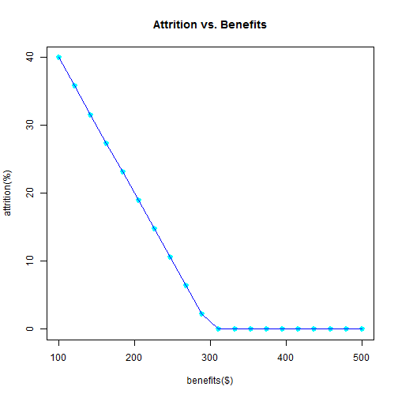
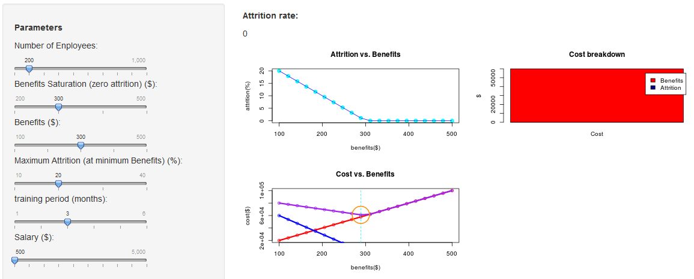

Cost Optimization 
========================================================
author: Ofir Shalev
date: 14/11/2014

The Problem
========================================================

Effective employee benefits will significantly reduce staff turnover and companies with the most effective benefits are using them to influence the behaviour of their staff and their bottom line, as opposed to simply being competitive

How can you find this optimal point, balancing between the increasing cost of employee benefits and the need to retain staff and reduce staff turnover?

The Tool
========================================================

This interactive application simulates the impact of multiple parameters on the overall cost, assuming a simple linear dependency between the attrition rate and the employee benefits:

 

The Tool in Action
========================================================

Model Parameters
========================================================

- Number of Employees
- Benefits Saturation : Any increase in benefits above the Benefits Saturation point will not have any impact on the attrition rates.
- Benefits ($)
- Max Attrition (%)
- Training Period (months)
- Salary ($)

